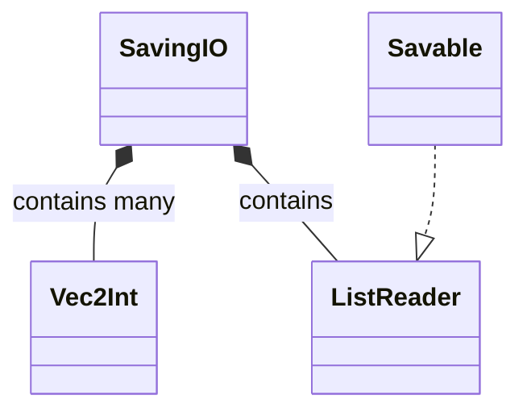
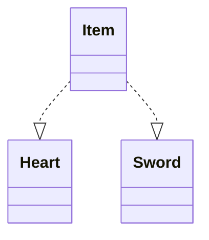
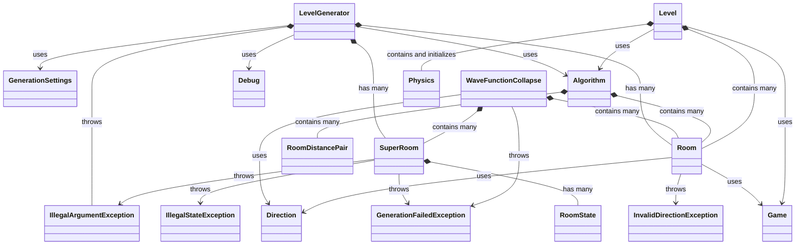
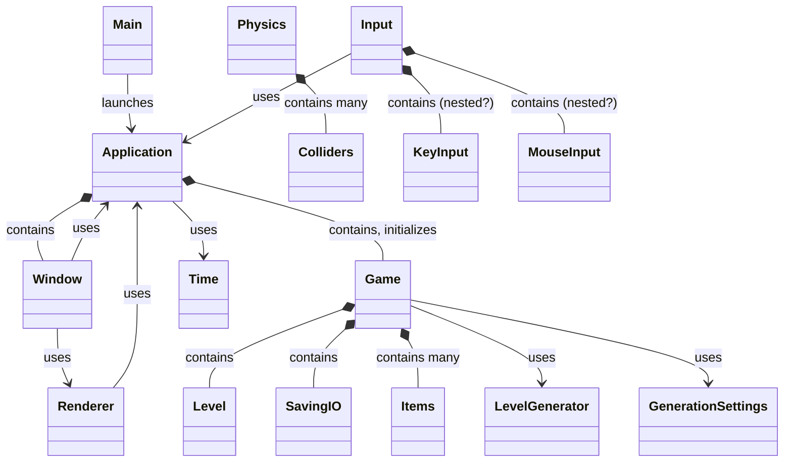
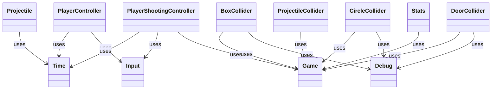

# Class diagrams

## Saving system class diagram

```mermaid
classDiagram
  SavingIO *-- Vec2Int: contains many
  SavingIO *-- ListReader: contains
  Savable ..|> ListReader
```
## Items class diagram

```mermaid
classDiagram
  Item ..|> Heart
  Item ..|> Sword
```
## Generation class diagram

```mermaid
classDiagram
  LevelGenerator --> GenerationSettings: uses
  LevelGenerator *-- Room: has many
  LevelGenerator *-- IllegalArgumentException: throws
  LevelGenerator *-- SuperRoom: has many
  LevelGenerator --> Algorithm: uses
  LevelGenerator --> Debug: uses

  SuperRoom *-- RoomState: has many
  SuperRoom --> GenerationFailedException: throws
  SuperRoom --> IllegalArgumentException: throws
  SuperRoom --> IllegalStateException: throws
  
  WaveFunctionCollapse *-- SuperRoom: contains many
  WaveFunctionCollapse *-- Room: contains many
  WaveFunctionCollapse --> GenerationFailedException: throws
  WaveFunctionCollapse --> Direction: uses
  
  Algorithm *-- RoomDistancePair: contains many
  Algorithm *-- Room: contains many

  Room --> Direction: uses
  Room --> InvalidDirectionException: throws
  Room --> Game: uses
  
  Level --> Algorithm: uses
  Level *-- Room: contains many
  Level *-- Physics: contains and initializes
  Level --> Game: uses
```
## Core class diagram

```mermaid
classDiagram
  Main --> Application: launches

  Application *-- Window: contains
  Application *-- Game: contains, initializes
  Application --> Time: uses

  Game *-- Level: contains
  Game *-- SavingIO: contains
  Game *-- Items: contains many
  Game --> LevelGenerator: uses
  Game --> GenerationSettings: uses

  Window --> Renderer: uses
  Window --> Application: uses

  Physics *-- Colliders: contains many

  Input --> Application: uses
  Input *-- KeyInput: contains (nested?)
  Input *-- MouseInput: contains (nested?)

  Renderer --> Application: uses
```
### Rendering class diagram

## Component system class diagram

```mermaid
classDiagram
  Projectile --> Time: uses

  PlayerController --> Time: uses
  PlayerController --> Input: uses

  PlayerShootingController --> Time: uses
  PlayerShootingController --> Input: uses
  PlayerShootingController --> Game: uses

  BoxCollider --> Game: uses
  BoxCollider --> Debug: uses

  CircleCollider --> Game: uses
  CircleCollider --> Debug: uses

  DoorCollider --> Game: uses
  DoorCollider --> Debug: uses

  ProjectileCollider --> Game: uses

  Stats --> Game: uses
```

