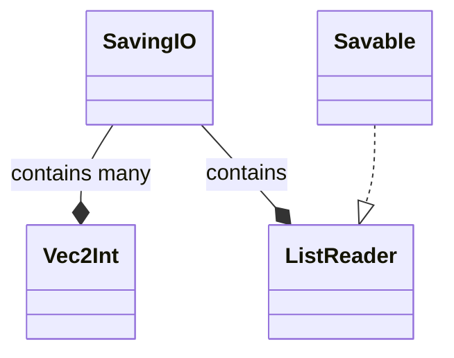
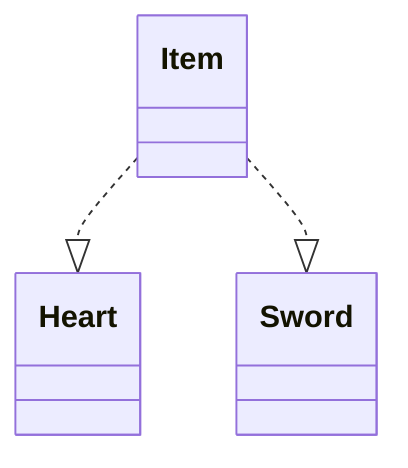
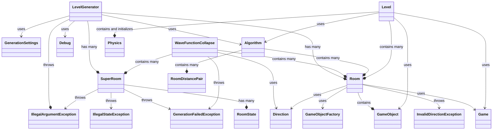
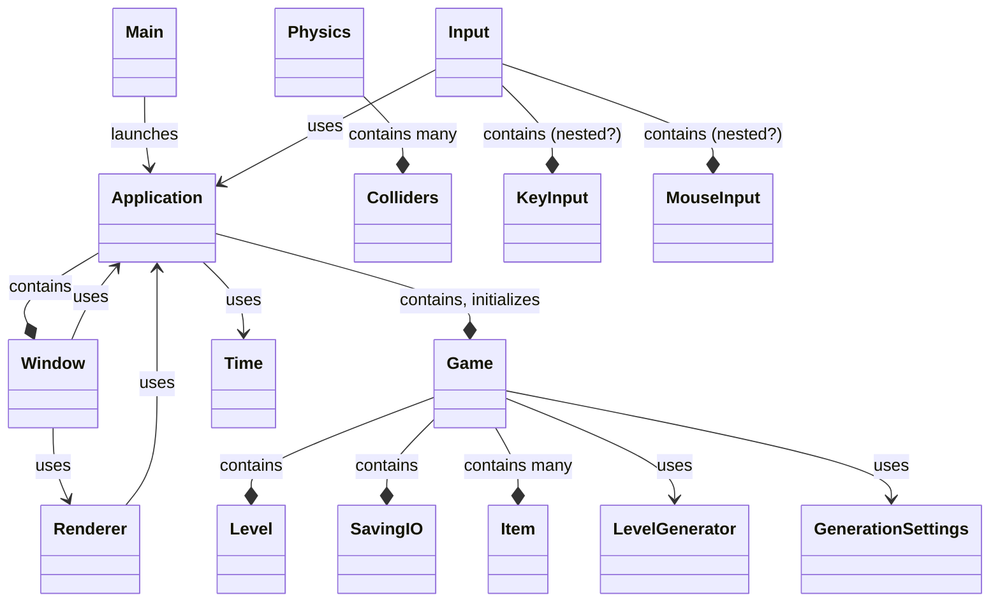
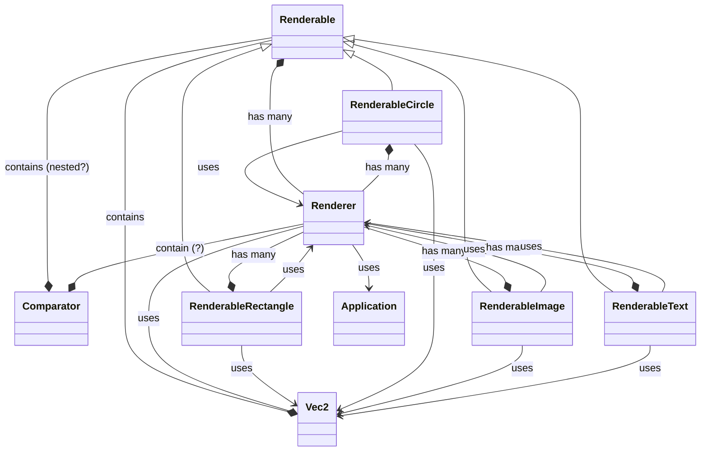
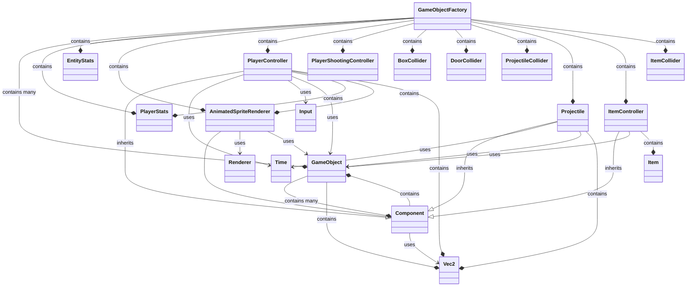
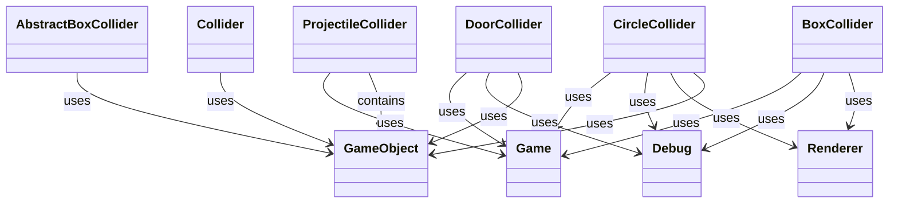
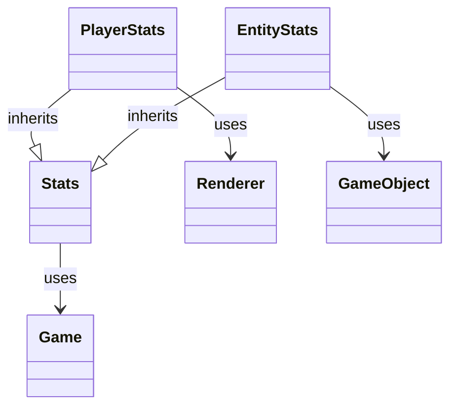
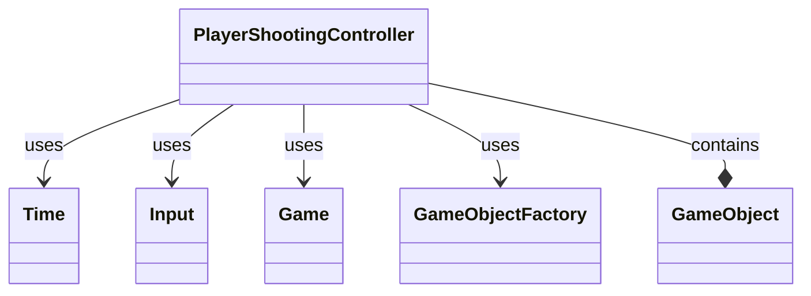

# Class diagrams

## Saving system class diagram

## Items class diagram

[//]: # (TODO split generation class diagram diagram)

## Generation class diagram

## Core class diagram

### Core Rendering class diagram

[//]: # (TODO split component class diagram diagram)

## Component system class diagram

### Component Colliders class diagram

### Component Stats class diagram

### Component Weapons class diagram
