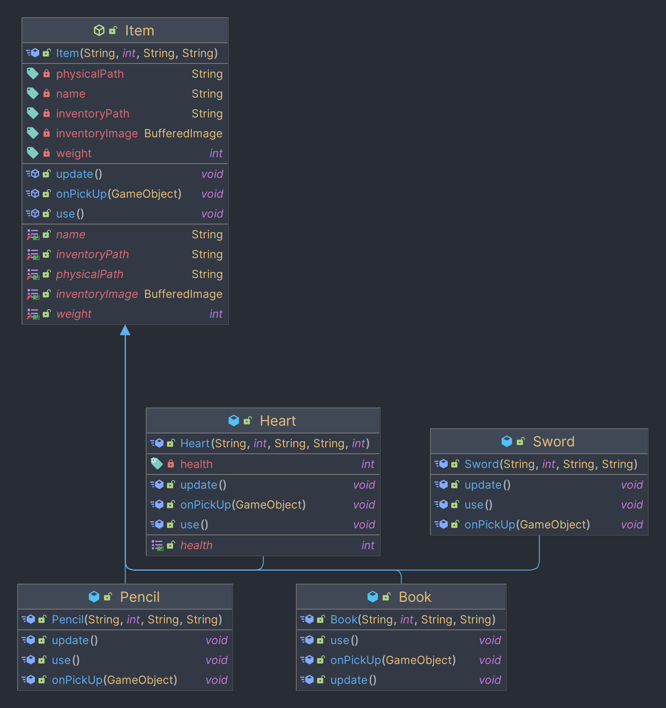
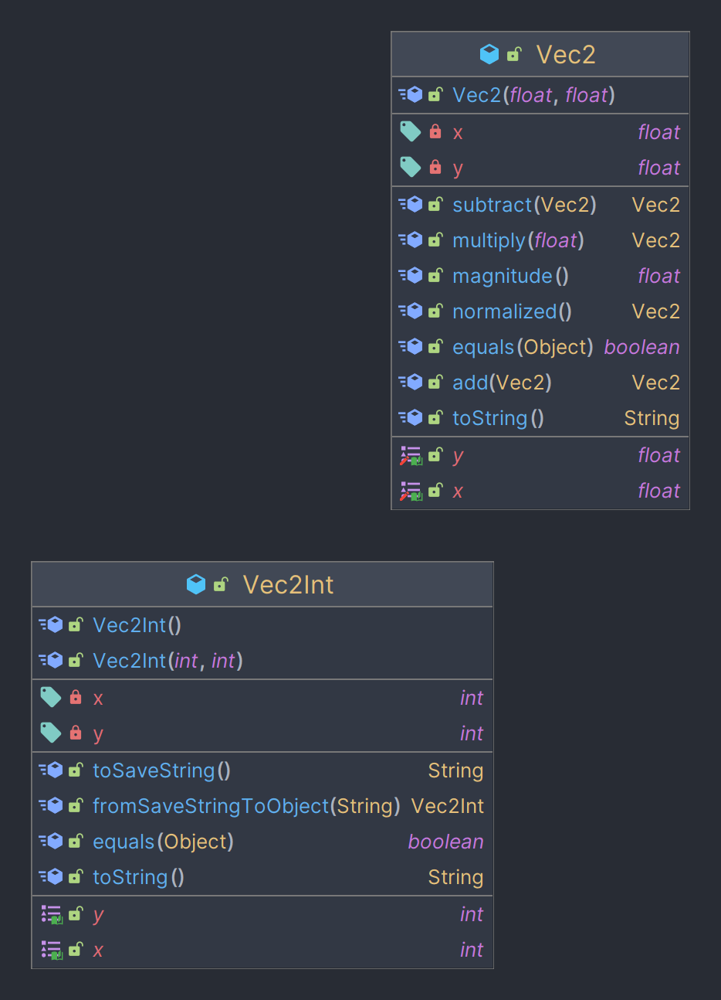

## Component system
<figure markdown="span">
  
</figure>

## Core
<figure markdown="span">
  { width="700" }
</figure>

## Generation
<figure markdown="span">
  { width="800" }
</figure>

## Items
<figure markdown="span">
  { width="600" }
</figure>

## Saving system
<figure markdown="span">
  { width="500" }
</figure>

## Utils
<figure markdown="span">
  { width="400" }
</figure>

## Complete
<figure markdown="span">
  
</figure>