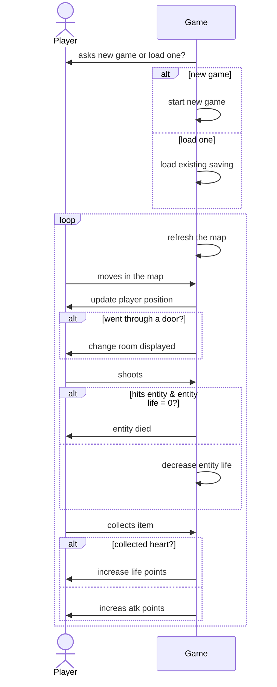
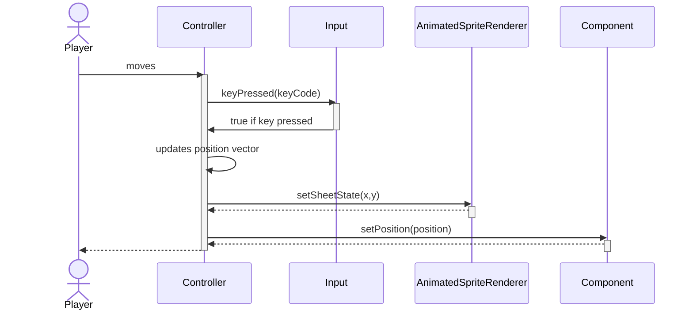
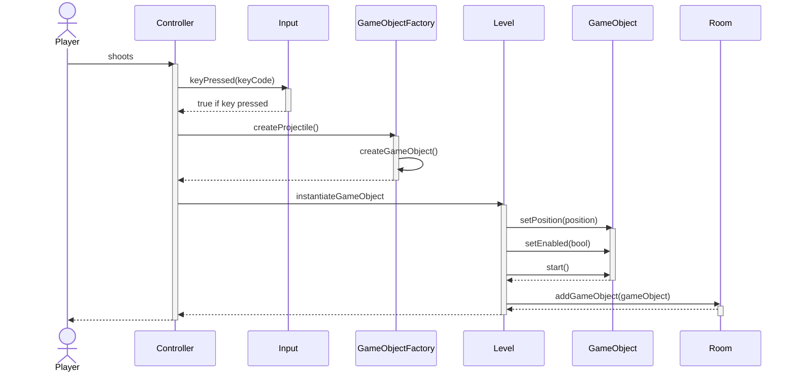
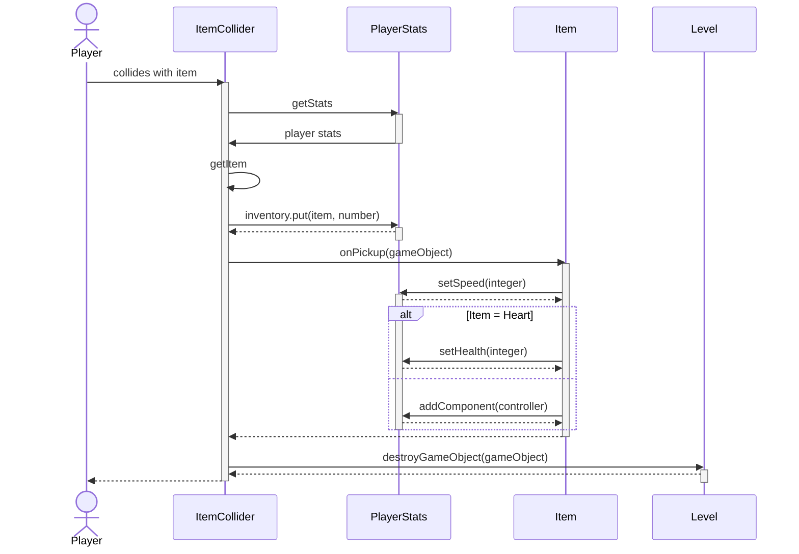
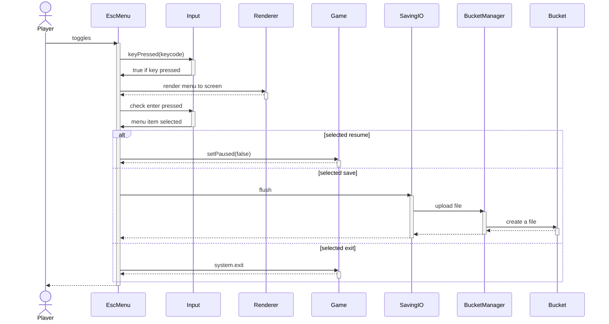
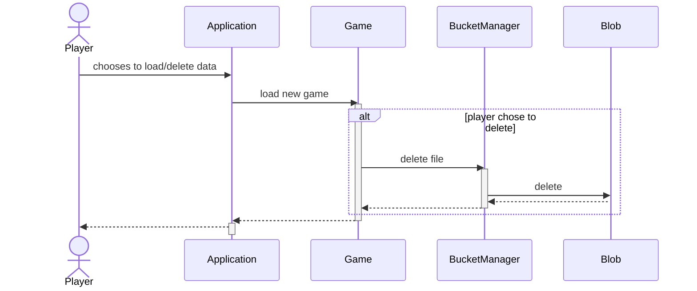

# Sequence diagram

## System Sequence diagram

``` mermaid
sequenceDiagram
  Actor Player
  Game ->> Player: asks new game or load one?
  alt new game
    Game ->> Game: start new game
  else load one
    Game ->> Game: load existing saving
  end
  loop  
    Game->>Game: refresh the map
    Player ->> Game: moves in the map
    Game ->> Player: update player position
    alt went through a door?
      Game->>Player: change room displayed
    end
    Player ->> Game: shoots
    alt hits entity & entity life = 0?
      Game ->> Player: entity died
    else
      Game ->> Game: decrease entity life
    end
    Player ->> Game: collects item
    alt collected heart?
      Game ->> Player: increase life points
    else
      Game ->> Player: increas atk points
    end
  end
```

## Internal sequence diagrams
### Movement

```mermaid
sequenceDiagram
  Actor Player
  Player ->> Controller: moves
  activate Controller
    Controller ->> Input: keyPressed(keyCode)
    activate Input
    Input ->> Controller: true if key pressed
    deactivate Input
    Controller ->> Controller: updates position vector
    Controller ->> AnimatedSpriteRenderer: setSheetState(x,y)
    activate AnimatedSpriteRenderer
      AnimatedSpriteRenderer -->> Controller: 
    deactivate AnimatedSpriteRenderer
    Controller ->> Component: setPosition(position)
    activate Component
      Component -->> Controller: 
    deactivate Component
    Controller -->> Player: 
  deactivate Controller
```

### Shooting

```mermaid
sequenceDiagram
  Actor Player
  Player ->> Controller: shoots
  activate Controller
    Controller ->> Input: keyPressed(keyCode)
    activate Input
      Input -->> Controller: true if key pressed
    deactivate Input
    Controller ->> GameObjectFactory: createProjectile()
    activate GameObjectFactory
      GameObjectFactory ->> GameObjectFactory: createGameObject()
      GameObjectFactory -->> Controller: 
    deactivate GameObjectFactory
    Controller ->> Level: instantiateGameObject
    activate Level
      Level ->> GameObject: setPosition(position)
      activate GameObject
        Level ->> GameObject: setEnabled(bool)
        Level ->> GameObject: start()
        GameObject -->> Level: 
      deactivate GameObject
      Level ->> Room: addGameObject(gameObject)
      activate Room
        Room -->> Level: 
      deactivate Room
      Level -->> Controller: 
    deactivate Level
    Controller -->> Player: 
  deactivate Controller
```

### Items

``` mermaid
sequenceDiagram
  Actor Player
  Player ->> ItemCollider: collides with item

  activate ItemCollider
    ItemCollider ->> PlayerStats: getStats
    activate PlayerStats
      PlayerStats ->> ItemCollider: player stats
    deactivate PlayerStats

    ItemCollider ->> ItemCollider: getItem

    ItemCollider ->> PlayerStats: inventory.put(item, number)
    activate PlayerStats
      PlayerStats -->> ItemCollider: 
    deactivate PlayerStats

    ItemCollider ->> Item: onPickup(gameObject)
    activate Item
      Item ->> PlayerStats: setSpeed(integer)
      activate PlayerStats
        PlayerStats -->> Item: 
        alt Item = Heart
          Item ->> PlayerStats: setHealth(integer)
          PlayerStats -->> Item: 
        else
          Item ->> PlayerStats: addComponent(controller)
          PlayerStats -->> Item: 
        end
      deactivate PlayerStats
      Item -->> ItemCollider: 
    deactivate Item

    ItemCollider ->> Level: destroyGameObject(gameObject)
    activate Level
      Level -->> ItemCollider: 
    deactivate Level
    ItemCollider -->> Player: 
  deactivate ItemCollider
```

### Saving

```mermaid
sequenceDiagram
  Actor Player
  Player ->> EscMenu: toggles
  activate EscMenu
    EscMenu ->> Input: keyPressed(keycode)
    activate Input
      Input ->> EscMenu: true if key pressed
    deactivate Input

    EscMenu ->> Renderer: render menu to screen
    activate Renderer
      Renderer -->> EscMenu: 
    deactivate Renderer

    EscMenu ->> Input: check enter pressed
    activate Input
      Input ->> EscMenu: menu item selected
    deactivate Input
    alt selected resume
      EscMenu ->> Game: setPaused(false)
      activate Game
        Game -->> EscMenu: 
      deactivate Game
    else selected save
      EscMenu ->> SavingIO: flush
      activate SavingIO
        SavingIO ->> BucketManager: upload file
        activate BucketManager
          BucketManager ->> Bucket: create a file
          activate Bucket
            Bucket -->> BucketManager: 
          deactivate Bucket
          BucketManager -->> SavingIO: 
        deactivate BucketManager
        SavingIO -->> EscMenu: 
      deactivate SavingIO
    else selected exit
      EscMenu ->> Game: system.exit
      activate Game
        Game -->> EscMenu: 
      deactivate Game
    end
    EscMenu -->> Player: 
  deactivate EscMenu
```

### Loading

```mermaid
sequenceDiagram
  Actor Player

  Player ->> Application: chooses to load/delete data
  Application ->> Game: load new game
  activate Game
    alt player chose to delete
      Game ->> BucketManager: delete file
      activate BucketManager
        BucketManager ->> Blob: delete
        activate Blob
          Blob -->> BucketManager: 
        BucketManager  -->> Game: 
      deactivate BucketManager
    end
    Game -->> Application: 
  deactivate Game


  activate Application
    Application -->> Player: 
  deactivate Application
```