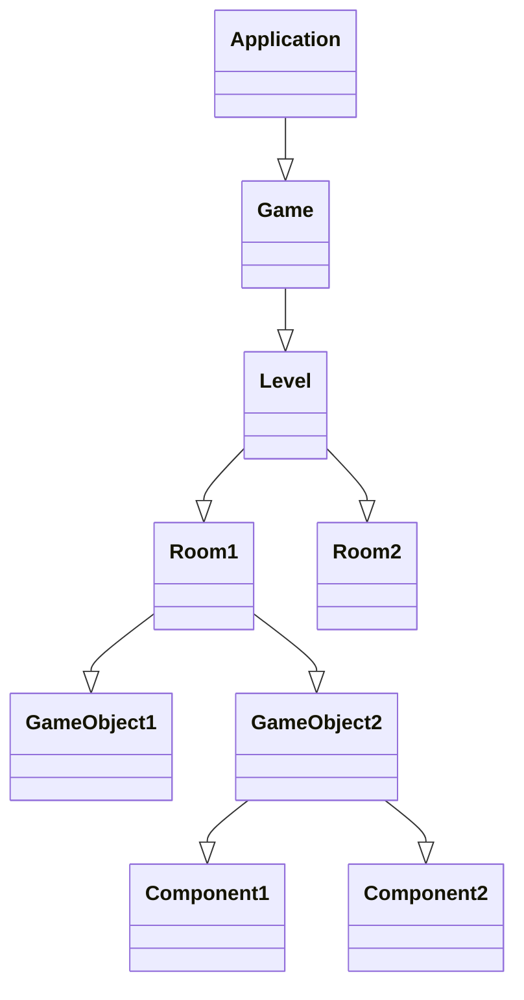

# __Exam Slayer - Final course exam project__

Full documentation of the project. Check out the source code [here](https://github.com/UNI-projects-team/exam-slayer).

## Brief description

Exam Slayer is a 2D graphical adventure game, set in an imaginary dungeon. The goal of the game is to __graduate__: as in real life,
to achieve such goal you need to pass some exams, represented in the game as boss to defeat.

## How to play
The game consists of __four bosses__, which represent four exams to pass. To complete the game, you need to pass each exam by finding and defeating the bosses. 

In addition, during the gameplay, you will have to deal with many enemies in order continue your adventure. To fight them, you can collect and use the items scattered in each room of the game map.

### Controls 
 - Move:
    - `W`: Move forward
    - `A`: Move left
    - `S`: Move backward
    - `D`: Move right
- Attack:
    - `Left arrow`: Shoot left
    - `Right arrow`: Shoot right
    - `Up arrow`: Shoot up
    - `Down arrow`: Shoot down
- General:
    - `ESC`: Pause the game
    - `Backspace`: when used in a save slot, it deletes the save 

    

## Installation and execution
To download the game in `.jar` format, get the last release from [here](https://github.com/UNI-projects-team/exam-slayer).

If you wish to compile the game yourself, make sure you have `git` and `maven` installed, the follow these instructions:
```bash
git clone https://github.com/UNI-projects-team/exam-slayer
cd exam-slayer
mvn clean compile assembly:single
java -jar target/exam-slayer-1.0.0-jar-with-dependencies.jar
```
The compilation process is automated with Maven, which create the `.jar` file in the `target/` directory inside the project root.

## Technologies used

| Name         | Version | Description                                                                 |
| :----------- | :------ | :-------------------------------------------------------------------------- |
| Lombok       | 1.18.32 | Java library that writes code like getters automatically                    |
| Junit        | 4.13.2  | Java framework used for developer-side testing on the JVM                   |
| Maven        | 3.9.6   | Software that manages the project's build and its dependecies               |
| Java Swing   | 1.4.2   | Graphic framework for Java, used to develop the GUI                         |
| Google cloud | 2.39.0  | Optimized library to connect to the google cloud API                        |
| Mokito       | 5.12.2  | Mocking framework for unit tests in Java, helps to create temporary classes |

## Project structure
Here is how the game is structured:
<div class="grid" markdown>

<div markdown>
- **Application**: It's the frame where the game is displayed, launched by the main file
- **Game**: The application launches one game
- **Level**: The game may contain multiple level, in this case just one
- **Room**: Each level contains multiple rooms, organized in the game map
- **GameObject**: Each room contains some game objects, like items and enemies
- **Component**: Each game object is composed by component, that allow it to do something (es. controllers, colliders)
<br>
### Exemple

Every GameObject is created with a set of components, like a controller that allows it to move, or a collider that allows it to interact with other objects.
If I want to create a player, I will contact the GameObject factory, which will create a GameObject with the components needed to move and shoot.

```java
public static GameObject createPlayer() {
    GameObject player = createGameObject("Player");

    return createGameObject(
            player, // GameObject   

            // All the components needed by the player
            new PlayerStats(player, 100, 15) 
                .addItem(new Book(
                    "DefaultPhysicsBook",
                    1,
                    "resources/textures/touchable/book.png",
                    "resources/textures/stats/items/defaultItem.png"
                )), // A builder pattern is used to create the player stats
            new AnimatedSpriteRenderer(player, "resources/textures/characters/MainCharacter.png", 32, 32, 1), // The sprite renderer
            new PlayerController(player), // The controller that allows the player to move
            new PlayerShootingController(player, WeaponType.PhysicsBook), // The controller that allows the player to shoot
            new BoxCollider(player, new Vec2(1.2f, 2), true, true), // The collider that allows the player to interact with other objects
            new PauseMenu(player), // The pause menu
            new BossKillCounter(player) // The counter that keeps track of the bosses killed
    );
}
```
</div>


</div>


## World generation
Each time a new game is created, a random map is generated; the map generation is handled with the `wave function collapse algorithm`. <br/> <u>Breaf explanation</u> of how it works: lets consider a grid that has to be filled following some rules. At first, the algorithm considers that every grid cells is potentially in every state permitted by the rules. In every loop, the algorithm sets the state for a specific cell, restricting the states the nearby cells could be by removing the invalid ones. The result is a grid filled following the rules.
For a more detailed explenation, refer to [this video](https://www.youtube.com/watch?v=2SuvO4Gi7uY&t=31s&pp=ygUXd2F2ZSBjb2xsYXBzZSBhbGdvcml0aG0%3D).

## Programming techniques used
- **Singletons**: used for classes such as *game*, which can't be instanciated more than once.
- **Controllers**: used to handle user input in the game. Eg. movement controller, shooting controller.
- **Factory**: used to create different types of game objects (eg. player, enemies, items).
- **Observer** such as to notify when an item is picked up.
- **Builder pattern**: used to create complex objects, like the inventory of the player.

## Setup bucket
The game is set up in a bucket on Google Cloud, which allows to store the game data and the save files. You need to have the credentials to access the bucket, which are stored in the `./resources/bucket/bucket_key.json` file. The bucket is used to store the game data and the save files.

